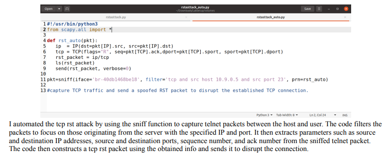
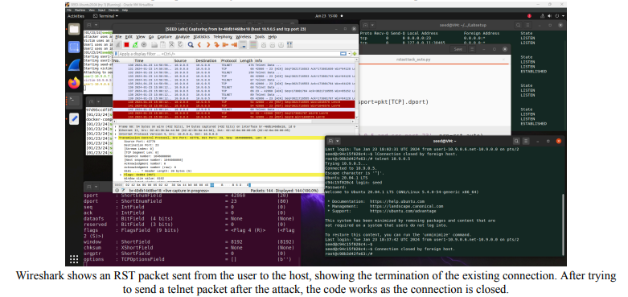

# TCP Attacks Lab

## Summary
- Hands-on TCP attacks: SYN Flooding, TCP RST attacks, TCP Session Hijacking, Reverse Shell.
- Includes attack execution, mitigation techniques, and screenshots.

## Lab Setup
- **Download:** [Lab Setup ZIP](https://seedsecuritylabs.org/Labs_20.04/Networking/TCP_Attacks/), [Docker Manual](https://github.com/seed-labs/seed-labs/blob/master/manuals/docker/SEEDManual-Container.md)
- **Ensure Docker is set up:** Follow [Lab PDF](https://seedsecuritylabs.org/Labs_20.04/Files/TCP_Attacks/TCP_Attacks.pdf) for instructions.

---

### SYN Flooding Attack
- **Objective:** Launch SYN Flood attack, overwhelm SYN queue, and test mitigation with SYN cookies.
- **Commands:**
  - Check SYN queue size: `sysctl -q net.ipv4.tcp_max_syn_backlog`
  - Monitor queue: `netstat -nat`
  - Enable SYN cookies: `sudo sysctl -w net.ipv4.tcp_syncookies=1`
  - Disable SYN cookies: `sudo sysctl -w net.ipv4.tcp_syncookies=0`
  - Launch attack: `gcc -o synflood synflood.c` and `synflood 10.9.0.5 23`
- **Screenshots:**
  - Without SYN cookies:
    
  - With SYN cookies:
    

---

### TCP RST Attack
- **Objective:** Forge RST packets to terminate active Telnet connections.
- **Steps:**
  - Prepare Scapy code to create RST packets.
  - Capture values with Wireshark (SEQ/ACK numbers).
  - Automate with sniffing-spoofing techniques.
- **Screenshots:**
  - Python Scapy code:
    
  - Wireshark outputs:
    
    
- **Bonus (Optional):**
   

---

### TCP Session Hijacking
- **Objective:** Inject malicious content into an existing session.
- **Steps:**
  - Use Scapy to craft packets with Wireshark-captured SEQ/ACK numbers.
  - Inject commands into the session.
- **Screenshots:**
  - Python code:
    
  - Hijacking Attack before/after:
     

---

### Reverse Shell Attack
- **Objective:** Gain shell access by injecting a reverse shell command into a session.
- **Steps:**
  - Set up netcat: `nc -lvp 9090`
  - Inject reverse shell command using Scapy.
- **Screenshot:**
  - Reverse shell output:
    

---

## What I learned
In the TCP Attack Lab, I gained hands-on experience with various network-based attacks, including SYN Flooding, TCP RST attacks, TCP session hijacking, and reverse shell creation.

### SYN Flooding Attack: 
I learned how a Denial of Service (DoS) attack works by overwhelming a server’s SYN queue with half-open connections, preventing legitimate users from connecting. I also explored methods to mitigate this using SYN cookies and observed the effects of the attack both with and without this countermeasure.

### TCP RST Attack: 
I learned how to use Scapy to craft and send forged RST packets to terminate an active TCP connection, such as a Telnet session, by analyzing sequence and acknowledgment numbers from Wireshark captures.

### TCP Session Hijacking: 
This task taught me how attackers can inject malicious content into an existing TCP session. By capturing SEQ and ACK numbers with Wireshark, I could manipulate ongoing Telnet communications using Scapy, injecting custom commands to simulate session hijacking.

### Creating a Reverse Shell: 
Finally, I learned how to create a reverse shell by hijacking an active TCP session, injecting a reverse shell command to gain remote access to the victim’s system. This task demonstrated how attackers can leverage existing connections to execute arbitrary commands on a compromised machine.

Overall, I developed a deeper understanding of how TCP vulnerabilities can be exploited and how attackers craft packets to disrupt or take over network connections, as well as some basic countermeasures to defend against these attacks.

